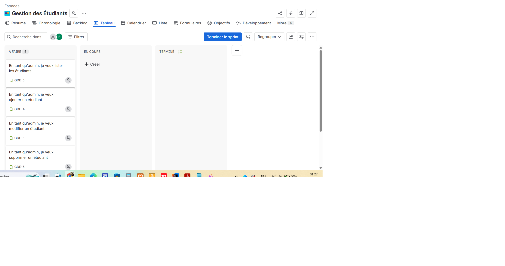
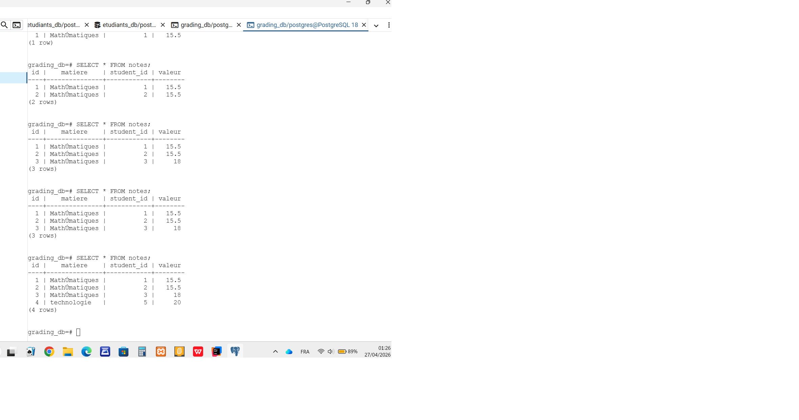

# Projet Gestion des Étudiants

> **Formateur :** Wahid Hamdi  
> **Technologies :** Spring Boot 4 · PostgreSQL · Docker · Flutter

Mini-projet complet composé d'une API REST, d'une base de données conteneurisée et d'une application mobile.

---

# Lien dockerhub

https://hub.docker.com/r/feridsaad/projet-etudiants-api

---

## 📂 Structure du projet

```


projet-etudiants/
├── .gitignore                <- Fichiers/dossiers ignorés par Git
├── architecture.txt          <- Documentation sur l’architecture du projet
├── docker-compose.yml        <- Orchestration des services (API, DB, etc.)
├── README.md                 <- Documentation principale du projet
│
├── .github/                  <- Configurations GitHub (issues, hooks)
│   ├── ISSUE_TEMPLATE/        <- Modèles pour bug reports et feature requests
│   └── java-upgrade/hooks/    <- Scripts PowerShell/Bash pour automatisation
│
├── .idea/                    <- Configurations IntelliJ IDEA
├── .vscode/                  <- Configurations VS Code
│
├── api-spring-boot/          <- API backend Spring Boot
│   ├── Dockerfile             <- Image Docker pour l’API
│   ├── pom.xml                <- Dépendances Maven
│   ├── src/
│   │   ├── main/java/com/example/api/
│   │   │   ├── EtudiantsApiApplication.java   <- Classe principale Spring Boot
│   │   │   ├── config/                        <- Configurations (Jackson, Redis, OpenAPI)
│   │   │   ├── controller/                    <- Contrôleurs REST (Etudiant, Département)
│   │   │   ├── dto/                           <- Objets de transfert (DTO)
│   │   │   ├── entity/                        <- Entités JPA (Etudiant, Département)
│   │   │   ├── exception/                     <- Gestion des exceptions
│   │   │   ├── mapper/                        <- MapStruct (conversion Entity <-> DTO)
│   │   │   ├── repository/                    <- Interfaces JPA Repository
│   │   │   └── service/                       <- Services métier
│   │   ├── main/resources/                    <- Configurations (application.properties)
│   │   ├── test/java/com/example/api/         <- Tests unitaires et BDD (Cucumber)
│   │   └── test/resources/features/           <- Scénarios Gherkin (.feature)
│   └── target/                                <- Fichiers compilés par Maven
│
├── docs/                     <- Documentation visuelle (schémas, Jira board)
│   ├── grading_db.png
│   ├── jira-board.png
│   └── jira-board-backlog.png
│
├── grading-service/          <- Service de gestion des notes
│   ├── pom.xml                <- Dépendances Maven
│   ├── src/main/java/com/example/grading/
│   │   ├── GradingServiceApplication.java     <- Classe principale
│   │   ├── controller/                        <- Contrôleur REST (NoteController)
│   │   ├── dto/                               <- DTO pour les notes
│   │   ├── entity/                            <- Entité Note
│   │   ├── exception/                         <- Exceptions personnalisées
│   │   ├── mapper/                            <- MapStruct (NoteMapper)
│   │   ├── repository/                        <- JPA Repository
│   │   └── service/                           <- Service métier
│   └── test/java/com/example/grading/         <- Tests unitaires
│
├── K8s/                      <- Manifests Kubernetes
│   ├── etudiant-deployment.yaml <- Déploiement API étudiants
│   └── postgres-deployment.yaml <- Déploiement base PostgreSQL
│
├── mobile-app/               <- Application Flutter (front-end mobile)
│   ├── pubspec.yaml           <- Dépendances Flutter
│   ├── lib/                   <- Code source Dart
│   │   ├── main.dart          <- Point d’entrée Flutter
│   │   ├── models/            <- Modèles (Etudiant)
│   │   ├── services/          <- Services API (api_service.dart)
│   │   └── screens/           <- Interfaces (liste des étudiants)
│   ├── android/               <- Projet Android natif
│   ├── ios/                   <- Projet iOS natif
│   ├── web/                   <- Version web (index.html, manifest.json)
│   ├── linux/                 <- Version Linux
│   ├── macos/                 <- Version macOS
│   └── windows/               <- Version Windows

````
### Lancer l'API localement (sans Docker)

Prérequis : Java 21+, Maven 3.9+, PostgreSQL 16 en cours d'exécution sur le port 5432.

1. Créer la base de données :
   ```sql
   CREATE DATABASE etudiants_db;
   ```

2. Démarrer l'application :
   ```bash
   cd api-spring-boot
   mvn spring-boot:run
   ```

3. Tester dans le navigateur ou avec curl :
   ```
   http://localhost:8081/api/etudiants
   ```

---

## Partie 2 — Docker (API + Base de données)

### Prérequis

- Docker Desktop installé et démarré

### Lancer le projet complet

Depuis la **racine** du projet (`projet-etudiants/`) :

```bash
docker compose up --build
```

L'API est ensuite accessible à :

```
http://localhost:8080/api/etudiants
```

### Arrêter les conteneurs

```bash
docker compose down
```

Pour supprimer aussi le volume de données PostgreSQL :

```bash
docker compose down -v
```

### Architecture Docker

```
┌─────────────────────────────────┐  réseau etudiants-network
│  spring-etudiants-api :8080     │◄──────────────────────────►  Votre machine
│  (Spring Boot 4 / Java 21)      │
└────────────────┬────────────────┘
                 │ jdbc:postgresql://db:5432
┌────────────────▼────────────────┐
│  postgres-etudiants :5432       │
│  (PostgreSQL 16)                │
└─────────────────────────────────┘
```

---

## Partie 4 — Déploiement Kubernetes

### Prérequis

- Kubernetes cluster (Minikube, Kind, ou cluster cloud)
- kubectl installé et configuré

### Déployer sur Kubernetes

Depuis le dossier `K8s/` :

1. Appliquer les déploiements :
   ```bash
   kubectl apply -f postgres-deployment.yaml
   kubectl apply -f etudiant-deployment.yaml
   ```

2. Vérifier les pods :
   ```bash
   kubectl get pods
   ```

3. Vérifier les services :
   ```bash
   kubectl get services
   ```

L'API sera accessible via NodePort sur le port 30080 de vos nœuds Kubernetes.

### Architecture Kubernetes

```
┌─────────────────────────────────┐
│  etudiant-deployment            │
│  (Spring Boot API)              │
│  Service: etudiant-service      │
│  NodePort: 30080                │
└────────────────┬────────────────┘
                 │ jdbc:postgresql://postgres-service:5432
┌────────────────▼────────────────┐
│  postgres-deployment            │
│  (PostgreSQL 16)                │
│  Service: postgres-service      │
└─────────────────────────────────┘
```

---

## Partie 3 — Application mobile Flutter

### Prérequis

- Flutter SDK 3.x installé (`flutter --version`)
- Un émulateur Android/iOS lancé **ou** un appareil physique connecté

### Installation

```bash
cd mobile-app
flutter pub get
```

### Configuration de l'URL de l'API

Modifier la constante `_baseUrl` dans `lib/services/api_service.dart` :

| Environnement | URL à utiliser |
|---------------|---------------|
| Émulateur Android | `http://10.0.2.2:8080` (valeur par défaut) |
| Simulateur iOS | `http://localhost:8080` |
| Appareil physique | `http://<IP-de-votre-machine>:8080` |

Pour connaître votre IP locale sur Windows :
```powershell
ipconfig
```

### Lancer l'application

```bash
flutter run
```

### Note : créer le projet Flutter from scratch

Si vous partez de zéro, exécutez d'abord :

```bash
flutter create mobile-app
```

Puis copiez/remplacez :
- `mobile-app/pubspec.yaml`
- `mobile-app/lib/` (tous les fichiers)

---

## Données initiales

5 étudiants sont insérés automatiquement au démarrage (via `DataInitializer`) si la table est vide :

| CIN | Nom | Date de naissance |
|-----|-----|-------------------|
| AB123456 | Ahmed Benali | 2001-03-15 |
| CD789012 | Fatima Zahra Alami | 2002-07-22 |
| EF345678 | Mohamed Chakir | 2000-11-08 |
| GH901234 | Sara Mansouri | 2003-01-30 |
| IJ567890 | Youssef Kadiri | 2001-09-14 |

---

## Stack technique

| Composant | Technologie |
|-----------|------------|
| API REST | Spring Boot 4.0.4 · Java 21 |
| Persistance | Spring Data JPA · Hibernate 6 |
| Base de données | PostgreSQL 16 |
| Conteneurs | Docker · Docker Compose |
| Application mobile | Flutter 3.x · package `http` |

---

## Partie 4 — Déploiement Kubernetes

### Prérequis

- Kubernetes cluster (Minikube, Kind, ou cluster cloud)
- kubectl installé et configuré

### Déployer sur Kubernetes

Depuis le dossier `K8s/` :

1. Appliquer les déploiements :
   ```bash
   kubectl apply -f postgres-deployment.yaml
   kubectl apply -f etudiant-deployment.yaml
   ```

2. Vérifier les pods :
   ```bash
   kubectl get pods
   ```

3. Vérifier les services :
   ```bash
   kubectl get services
   ```

L'API sera accessible via NodePort sur le port 30080 de vos nœuds Kubernetes.

### Architecture Kubernetes

```
┌─────────────────────────────────┐
│  etudiant-deployment            │
│  (Spring Boot API)              │
│  Service: etudiant-service      │
│  NodePort: 30080                │
└────────────────┬────────────────┘
                 │ jdbc:postgresql://postgres-service:5432
┌────────────────▼────────────────┐
│  postgres-deployment            │
│  (PostgreSQL 16)                │
│  Service: postgres-service      │
└─────────────────────────────────┘
```

## Board Jira



## Board Jira-backlog


## grading_db




